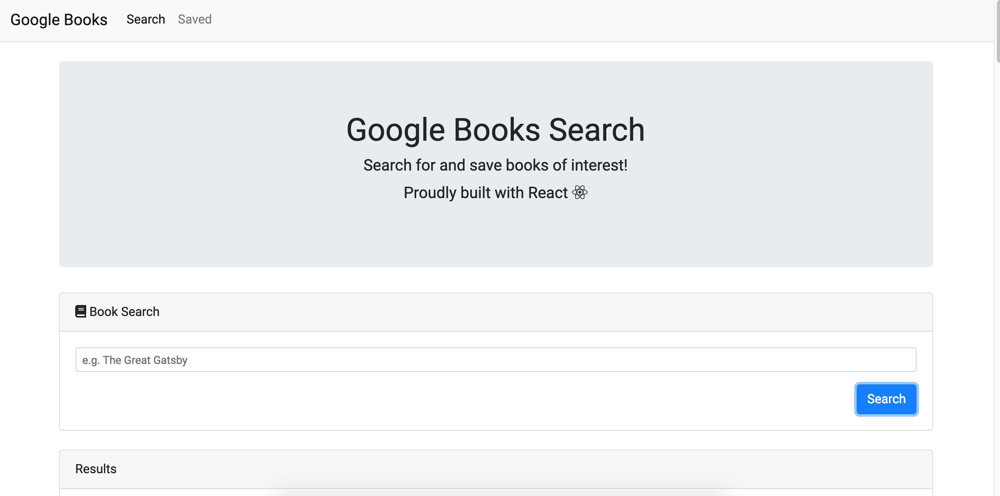
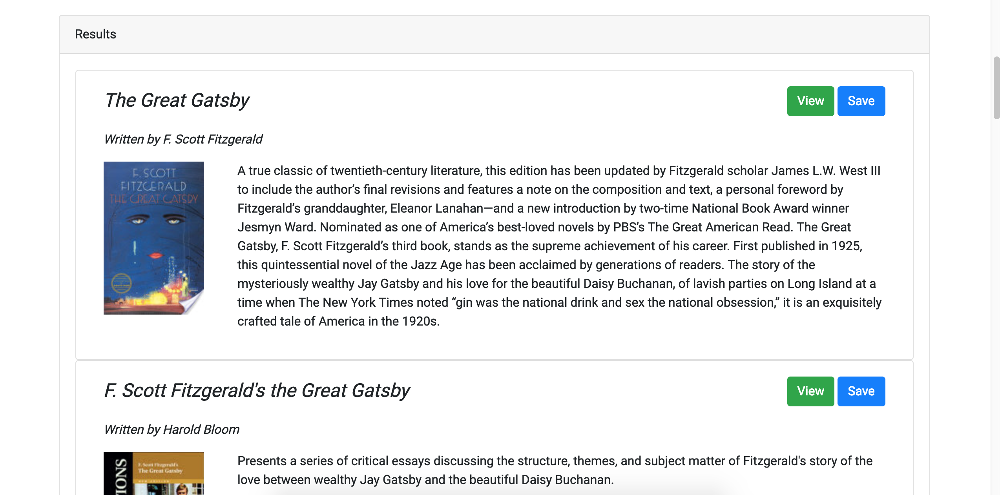
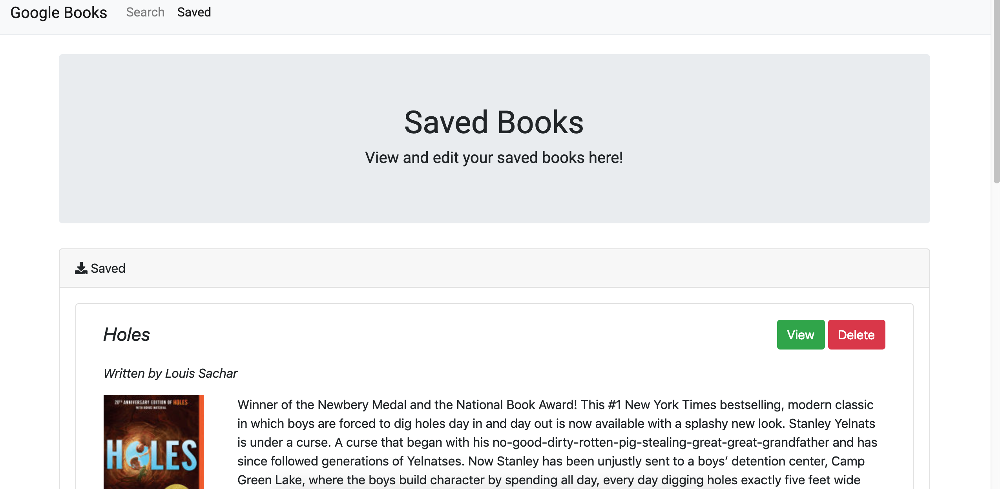

# Google-Books-Search

## Introduction
Hello! Google Book Search is an application that allows 
users to search for books using the Google Books API and 
save them for future viewing. It utilizes React.js on the frontend, and Node.js, Express, and MongoDB on the backend.

Please see the Heroku live link below as well as a screenshot of the application!

Live link: https://fathomless-journey-73583.herokuapp.com/

Please read on for more information!

## Technologies
HTML 
CSS 
Bootstrap 
JavaScript 
React.js 
Node.js 
Express 
MongoDB 

## Methodology 
The general principle used in this app was to work with user data and perform CRUD operations on a database. Using React, I created various user interface components that were linked with certain states. Depending on whether the user searched for a book, saved a book, or deleted a book, I performed a relevant database query and altered the state of the components. This in turn would re-render only the appropriate section of the page as opposed to the entire document (the awesome magic of React!).

The biggest challenges that arose were working with the interface components correctly, specifically creating methods that would manipulate internal and external states. However, with a bit of online research, asking questions and trial and error, I was able to apply the right techniques and ultimately get the app working correctly!

Additionally, another challenge that came up was working with heroku deployment. It turns out that a simple typo may allow your program to work locally but may break a few things online! It took a bit of exploring, reading and researching error methods, but in the end, it all worked! 

All in all, this was a fantastic project that really helped me hone in and improve my React skills, as well as further develop my database integration and backend development.

Please take a look at my code and app and feel free to reach out with any questions!

